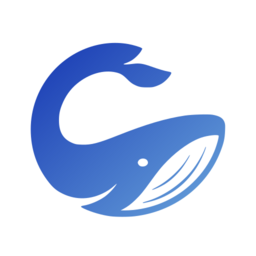

# Codewhale extensions

A home for useful Codewhale plugins, skills, connections, and chat integrations.
Each extension should help someone complete a real task and explain how to tell
whether it worked.

Read the repository's [source-sealed wiki](whalewiki/INDEX.md), or build its
offline reader with `node plugins/whalewiki/scripts/whalewiki.mjs export` and
open `whalewiki/whalewiki.html`. Run `npm run check:wiki` to check its evidence.

## Choose what you need

| Job | Start here | What is available |
| --- | --- | --- |
| Understand a repo and find where to change it | [WhaleWiki](plugins/whalewiki/README.md) | Cited explanations, documentation impact lookup, six read tools and an offline reader |
| Work in the Chrome tab you are looking at | [Codewhale for Chrome](plugins/chromewhale/README.md) | A side panel and `page_*` tools for selected tabs and frames in your own browser and sessions, gated per site. Load the bundled extension unpacked |
| Operate a computer | [Computer Use](https://codewhale.net/computer-use) | App scripting, isolated Linux desktops and consent controls. Pair it with the [published Mac app (v0.12.0)](https://github.com/codewhale-hq/codewhale-cu-plugin/releases/tag/v0.12.0) for one-grant control; without the app the tools use the host’s own grants. [Source and platform support](plugins/computer-use/README.md) |
| Look up Cloudflare documentation | [Cloudflare docs](plugins/cloudflare-docs/skills/cloudflare-docs/SKILL.md) | Official remote MCP; no credential required |
| Build and deploy on Cloudflare | [Cloudflare](plugins/cloudflare/README.md) | Workers, KV, R2, D1, Durable Objects and Pages-to-Workers skills, an offline `/cloudflare-preflight` config check, and a deploy that waits for your approval. Pair with Cloudflare docs |
| Deploy to Vercel | [Vercel workflow](plugins/vercel-workflow/README.md) | Deploy (preview or production) only after you approve, environment variables, logs, Next.js config and an offline `/vercel-preflight`. Uses your own Vercel CLI login; no MCP server |
| Add workflows to an agent | [47 skills, organized by task](skills/README.md) | Coding, research, documents, email, calendar, travel, shopping, photos and audio; setup requirements shown |
| Add only one kind of workflow | [Document skills](plugins/skills-docs/README.md), [Google skills](plugins/skills-google/README.md), [Personal skills](plugins/skills-personal/README.md), [Dev process skills](plugins/skills-dev-process/README.md) | The same reviewed skills as the 47-skill pack, split by domain so you install the one you need. Install either a domain plugin or the pack for a given skill, not both |
| Review a diff, branch or PR | [Review toolkit](plugins/review-toolkit/README.md) | Six read-only specialist reviewers and `/review-pr`, which runs them in parallel and merges one ranked report |
| Keep working until a task is done | [Loop](plugins/loop/README.md) | `/loop` re-prompts the session with a hard iteration cap, a completion phrase and `/cancel-loop`. macOS and Linux; needs `[control_socket] enabled = true` |
| Review a user interface | [Design review](plugins/design-review/README.md) | Design critique, WCAG accessibility audit with a static scanner and contrast calculator, and UX copy review |
| Build a single-page web artifact | [Web artifacts builder](plugins/web-artifacts-builder/README.md) | Scaffold, build to one self-contained HTML file, check it and preview it on loopback only |
| Work with GitHub pull requests and issues | [GitHub workflow](plugins/github-workflow/README.md) | PR review and issue triage over GitHub's official remote MCP with your own token; never posts without your approval |
| Work with Linear issues | [Linear workflow](plugins/linear-workflow/README.md) | Triage, evidence-based claim and status updates over Linear's official remote MCP with your own API key; shared writes need your approval |
| See how each way of adding a plugin works | [Sample plugins](plugins/samples/README.md), [Hello extension](plugins/samples/hello-extension/README.md) | A native TypeScript extension (experimental host), a DSH package and a Claude-format bundle. Only Hello extension is in the catalog |
| Understand an agent run | [Whalesong](plugins/whalesong/skills/whalesong-analyze/SKILL.md) | Trace analysis, comparisons and audio from a local Whalesong platform |
| Connect Linear, GitHub or another service | [Connections](docs/CONNECTIONS.md) | Official endpoints and honest setup/qualification status. The GitHub and Linear workflow plugins add skills on top of a token you supply; a plugin never replaces the connection |
| Use Telegram, WeChat, WeCom or Feishu | [Chat integrations](integrations/README.md) | Existing Core bridges, packaged here with source provenance |
| Receive Slack mentions or Linear webhooks | [Webhook bridge](integrations/webhook-bridge/README.md) | Signed, allowlisted intake, durable queue and explicit runtime dispatch; reply delivery remains open |
| Build a review bot | [Review bot guide](docs/REVIEW-BOT.md) | Review workflow, implementation boundaries and required host integration |

Try “summarize my unread email”, “make an audio briefing”, or “review this PR”.
The [skill directory](skills/README.md) explains which tools or accounts each
workflow needs. Installing instructions does not establish those connections.

## Install a plugin

Clone this repository, then add its local catalog in Codewhale:

```text
/plugin marketplace add codewhale /absolute/path/codewhale-plugin-marketplace/marketplace.json
```

A catalog entry does not install or authorize anything. Install the selected
plugin, review its capabilities, then trust and enable it through Codewhale.

For a development checkout, package the selected plugin first. Local build and
receipt files can exceed the installer's 5 MiB cap even when the source fits:

```sh
npm run package:plugin -- whalewiki
npm run package:plugin -- computer-use
```

Install the resulting `dist/<name>` directory. Packaging excludes Git-ignored
artifacts, refuses symlinks, enforces the size cap and never overwrites an existing
package. Pass `--out /another/output/directory` for a later build. A clean clone
can use the catalog's `path:` sources directly.

Codewhale carries its own Computer Use runtime and bundled skills. Installing a
reviewed marketplace copy is optional; inspect existing plugins before adding a
duplicate. This repository does not replace account connection management.

## Develop and verify

Node 22+ and Git are required for repository development. WhaleWiki and Computer
Use have no runtime npm dependencies. Browser tests use Playwright as a dev tool.

```sh
npm ci
npx playwright install chromium
npm run check
npm test && npm run check:web
```

On macOS, browser checks use an installed Google Chrome when available. Set
`CW_BROWSER_PATH` to select another Chromium executable. CI installs Chromium.
Tests never require live service credentials or model calls. Native tests skip
platforms unavailable on the host; those skips are not platform acceptance.

`npm test` runs each plugin's own tests, found by `scripts/test-plugins.mjs`
(`npm run test:plugins`), so a new plugin's tests cannot be left out. Two suites are
opt-in because they need a real Codewhale or the npm registry: `LOOP_E2E=1`
(drives the installed TUI through tmux) and `WAB_E2E=1` (a real React build).

`npm run skills -- email` searches the complete skill directory. After a reviewed
Core skill commit, `npm run sync:skills` updates the active skills, all supporting
resources, source hashes and directory together, then refreshes the copies in the
four `skills-*` domain plugins (`npm run check:skill-plugins` verifies them). Retired migration bodies are
excluded. `npm run check -- --core ../codewhale` detects upstream drift as well
as local packaging errors.

`npm run check:cu-sync` compares the Computer Use mirror against sibling source
checkouts. [Validation evidence](docs/MARKETPLACE-REVIEW-20260919.md) records the current
source, packaging, local checks and remaining qualification work.

Core embeds this catalog for offline browsing and installs each selected bundle
through its existing reviewed installer. After a catalog or bundle update,
commit the marketplace change and run `python3 scripts/sync-marketplace.py`
from the sibling Core checkout. Core's `Marketplace connection` workflow checks
the pinned catalog on changes and checks current upstream mirrors weekly.
See Core's [marketplace maintenance guide](https://github.com/codewhale-hq/Codewhale/blob/main/docs/PLUGIN_MARKETPLACE.md)
for source ownership, update commands, and the publication order. Catalog
membership never grants trust or enablement to an installed plugin.

## Contribute

Read [CONTRIBUTING.md](CONTRIBUTING.md). Put installable capabilities in `plugins/`,
service setup in `connections/`, and inbound bots in `integrations/`. A plugin
needs a useful capability beyond carrying a service URL. Keep one runtime and
reuse the existing bridge and authentication owners.

Each bundle carries its own license. Vendored integrations retain Core's license
and exact provenance in `integrations/upstream.json`.
