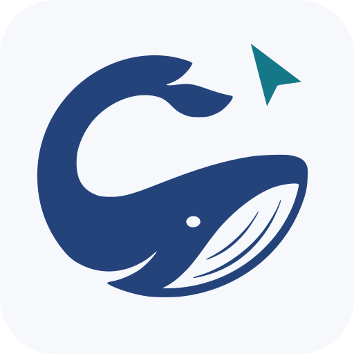

<picture>
  <source media="(prefers-color-scheme: dark)" srcset="assets/icon-dark.svg">
  
</picture>

# Computer Use

**By Codewhale · macOS beta (notarized app and source) · Windows and Linux experimental, source only**

Let Codewhale see and operate your apps. Read accessible controls, enter
text, click, scroll and capture the selected app through the same MCP tools.
The macOS helper keeps permissions and human controls in one menu-bar app.

- **Set up once.** See Accessibility and Screen Recording status, open the
  right Settings pane, then run a check in a disposable practice window.
- **Keep working.** macOS selects apps in background mode by default. Clicks,
  drags and scrolls reach the selected app's windows without moving the
  user's cursor (a momentary no-raise front lease is reported in every
  receipt); only hover and held-button gestures still need foreground
  control, chosen with the user's authorization. Background support varies
  by application.
- **Stay in control.** See selected apps and their input modes. Pause cancels
  queued work and releases held input; Stop ends existing sessions. Only the
  person using the menu-bar controls can allow input again.
- **Update deliberately.** The app checks for stable releases on request.
  Updates verify the digest, Codewhale signature and Apple notarization before
  replacing the app, and retain the previous install for rollback.

[Setup page](https://codewhale.net/computer-use) ·
[Setup and troubleshooting](docs/TROUBLESHOOTING.md) ·
[Release notes](CHANGELOG.md) · [Distribution](docs/DISTRIBUTION.md) ·
[Background demo](docs/DEMO.md) · [Contributing](CONTRIBUTING.md) ·
[Security](SECURITY.md)

## Install

Three doors, same destination — pick one:

1. **Mac app (easiest).** Download the disk image from the latest stable
   [GitHub release](https://github.com/Hmbown/codewhale-cu-plugin/releases),
   drag it to Applications, and open it. Open **Computer Use…** from the
   whale menu-bar icon, grant what it asks (Accessibility, then Screen
   Recording), and run the background check. No terminal, no Node, no
   compiler needed.
2. **Inside Codewhale.** Computer Use ships built in: review, trust and
   enable it through Codewhale's plugin panel. The Mac app from door 1 is
   what gives it real control; without it the tools load and tell you
   what's missing instead of failing blind.
3. **From source.** Clone, test, install:
   ```bash
   git clone https://github.com/Hmbown/codewhale-cu-plugin
   cd codewhale-cu-plugin
   npm test                # unit + protocol, no GUI input performed
   npm run build:app       # dist/{macos,linux,windows}
   npm run install:app     # puts the app in place, registers it, opens it once
   ```
   Needs Node 20+ and, on a Mac, Xcode Command Line Tools. Then wire your
   host from the table in [Developer quick start](#developer-quick-start).

**Verify (every door).** Ask your host for `request_access`: a working
install reports `via: "app"`, `app.version` matching the plugin,
Accessibility `granted` and screen capture `ok`. Anything else names the
missing piece — install the app, add the grant, or check the host wiring,
in that order. If it names a permission, the fix is in
[Setup and troubleshooting](docs/TROUBLESHOOTING.md).

**Status.** Release status is recorded in [CHANGELOG.md](CHANGELOG.md). The
notarized Mac app is published on this repository's
[GitHub releases](https://github.com/Hmbown/codewhale-cu-plugin/releases)
(latest stable: v0.6.0; source here is 0.8.0 plus fixes — the next stable
cuts after its qualification gates pass); remaining gates are tracked in
[the release checklist](docs/RELEASE_CHECKLIST.md). The
[setup page](https://codewhale.net/computer-use) will offer the disk image
directly once its download section ships — until then, download from the
releases page.

The native setup panel, background check and updater require **macOS 13.5+**
for the self-contained bundle. The source MCP server includes experimental
Windows and Linux backends, with HarmonyOS devices over hdc. Windows and
Linux are source-only: they do not yet have the native human controls,
exact-window targeting or qualified installers, and they are excluded from the
plugin's public host eligibility until those gates pass. Their raw input uses
the shared desktop and must not be treated as background control. Windows
semantic mutations currently refuse scoped element targets. See the
[publication review](docs/PUBLICATION_REVIEW.md) and
[porting plan](docs/PORTING.md).
The SSH route remains experimental. See the platform-specific
[limitations](docs/LIMITATIONS.md).

The server works with MCP hosts including Codewhale, Kimi Code, Claude Code,
Codex CLI and Cursor. It has zero runtime npm dependencies. Developer
checkouts use Node 20+; the macOS distribution includes a pinned Node 24 LTS
runtime. Codewhale still reviews, trusts and enables a plugin through its
existing Engine authority before the model can use it.

## The Mac app

The notarized universal app ships as a drag-to-Applications disk image on
this repository's
[GitHub releases](https://github.com/Hmbown/codewhale-cu-plugin/releases),
only from a published stable release whose `release.json` receipt qualifies;
the ZIP archive on the same release is what the in-app updater installs.
The plugin marketplace links there; the
[setup page](https://codewhale.net/computer-use) will offer the image
directly once its download section ships. Release
status is recorded in [CHANGELOG.md](CHANGELOG.md). To build and install
from source instead, use door 3 in [Install](#install). See
[docs/DISTRIBUTION.md](docs/DISTRIBUTION.md) for the packaging,
notarization and release procedure.

## Developer quick start

Install the desktop helper first ([Install](#install), any door), then point
your host at the server:

| Host | Configuration |
|---|---|
| Codewhale | Discovers the Agent Plugins v1 bundle (`plugin.json` + `mcp.json`); nothing to configure. |
| Kimi Code | Run `/plugins install /path/to/codewhale-cu-plugin`, then `/reload`. The native `kimi.plugin.json` registers the server and skills. |
| DeepSeek Harness (`dsh`) | `dsh plugin --profile web add @codewhale/computer-use-dsh`, then link `skills/` into `~/.dsh/skills`. See [DeepSeek Harness](#deepseek-harness-dsh). |
| Claude Code | `claude mcp add computer -- node /path/to/mcp/server.mjs` |
| Codex CLI | `~/.codex/config.toml`: `[mcp_servers.computer]` `command = "node"` `args = ["/path/to/mcp/server.mjs"]` |
| Cursor / Windsurf / VS Code | `{"mcpServers":{"computer":{"command":"node","args":["/path/to/mcp/server.mjs"]}}}` |
| Gemini CLI | same JSON in `~/.gemini/settings.json` |
| opencode | `{"mcp":{"computer":{"type":"local","command":["node","/path/to/mcp/server.mjs"]}}}` |

`/path/to/mcp/server.mjs` can be this checkout or the stable copy inside the
installed app (`install:app` prints it — on macOS
`~/Applications/Codewhale Computer Use.app/Contents/Resources/plugin/mcp/server.mjs`).
`npm link` also gives you a `codewhale-cu` command for hosts that want one.

### Kimi Code

Install the desktop helper above first, then use Kimi's `/plugins install`
command with this checkout's absolute path. Review the local plugin and choose
**Trust and install**. Kimi copies it into its managed plugin directory and
enables its MCP server. Run `/reload` in an existing session, then `/mcp`:
`plugin-codewhale-computer-use:computer` should show **connected** and the
tool list (36 advertised in 0.8.0; counts vary by host).
`/plugins info codewhale-computer-use` shows the installed version and status.
This flow was verified with Kimi Code 0.41.0. See the
[Kimi plugin documentation](https://moonshotai.github.io/kimi-code/en/customization/plugins.html)
for managed updates and removal.

The server needs Node 20 or newer on Kimi's PATH and uses the installed
Codewhale permission helper. Existing MCP servers and model settings are
preserved. Models without vision can read the default text observations and
request local macOS OCR; models with vision can also request screenshots.

### DeepSeek Harness (dsh)

Install the desktop helper above first, then add the bundle in
[`integrations/dsh`](integrations/dsh). `dsh` manages a profile's plugins as
npm packages: `dsh plugin` forwards to pnpm in the profile directory and then
reconciles `dsh.profile.bundles`, so one command installs the package *and*
adds its patch layer to the profile.

```bash
dsh plugin --profile web add @codewhale/computer-use-dsh
```

Use the path to this checkout's `integrations/dsh` instead of the package name
to install from source. The tools arrive as `mcp__computer-use__<name>`; the
bundle runs the server from the installed app with the Node already running
`dsh`, so nothing else needs configuring. Set `CODEWHALE_CU_SERVER` to point at
a `/Applications` install or a source checkout's `mcp/server.mjs`.

The two skills install separately. A profile whose agent presets own skill
discovery — the `web` profile is one — disables the host-level
`skill-filesystem` row, so a bundle cannot reach it. The user skill root is
read in every composition:

```bash
PLUGIN="$HOME/Applications/Codewhale Computer Use.app/Contents/Resources/plugin"
mkdir -p ~/.dsh/skills
ln -sfn "$PLUGIN/skills/computer-use" ~/.dsh/skills/computer-use
ln -sfn "$PLUGIN/skills/recording"    ~/.dsh/skills/recording
```

To scope desktop control to sessions that ask for it rather than every session
on the profile, put the same `mcp-computer-use` row in an agent preset instead
of installing the bundle: duplicate `standard` in the `dsh` UI, then add the
row from `integrations/dsh/cordis.patch.yml` to the copy's `agent.cordis.yml`
and set `customSkillDirs` on its `skill-filesystem`. A preset whose rows cannot
be resolved is listed as broken with the reason, so a typo shows up in the
picker rather than at session start.

Verified with `dsh` 0.1.5-rc.1 and plugin 0.6.0 on macOS: `dsh plugin add`
into a profile, 44 tools bridged, both skills in the catalog, and a live
`computer_list` call returning from the helper. Remove it with `dsh plugin
--profile web remove @codewhale/computer-use-dsh`. Models without vision read
the default text observations and can request local macOS OCR; models with
vision can also request screenshots, which `dsh` bridges as attachments.

## The desktop app

macOS grants Accessibility and Screen Recording to the *responsible process*
of a permission check. A bare `node mcp/server.mjs` inherits its host's
identity, so the grant lands on Terminal, Cursor, or Claude, and every host
needs its own. The app fixes that:

- **What it is** — a tiny native launcher (`app/macos/launcher.c` on macOS)
  that runs `app/daemon.mjs`, a long-lived process that executes the platform
  backend and answers one-line JSON requests over a per-user socket
  (`~/.codewhale-cu/app.sock`, a named pipe on Windows). Only the same
  allow-listed tool set the ssh agent accepts will execute; the socket is
  never a shell.
- **How the server uses it** — every call on the local computer goes through
  the app when it is running. If it is installed but not running, the server
  launches it (via LaunchServices on macOS, so it is its own responsible
  process) and waits for it. If it is not installed, calls run directly in
  the server process as before. `request_access` reports which mode is active
  (`via: "app"` or `"direct"`) and, in direct mode, how to install the app.
  A registered helper takes priority over Codewhale's embedded native helper;
  if the registered helper cannot start, input fails closed. Without a
  standalone registration, Codewhale can use its embedded permission identity.
  `CODEWHALE_CU_APP=off` is an explicit developer override for direct mode,
  never an agent workaround for the person's Pause or Stop choice.
- **First launch** — open the whale menu to review permission status. Only the
  setup buttons request grants; starting the helper does not prompt automatically.

Where `install:app` puts things:

| OS | App | Also |
|---|---|---|
| macOS | `~/Applications/Codewhale Computer Use.app` (registered with LaunchServices) | `--login`: `~/Library/LaunchAgents/net.codewhale.computer-use.plist` |
| Linux | `~/.local/share/codewhale-computer-use` | `~/.local/bin/codewhale-computer-use`, `~/.local/share/applications/net.codewhale.computer-use.desktop`, hicolor icons; `--login`: `~/.config/autostart/` |
| Windows | `%LOCALAPPDATA%\Programs\Codewhale Computer Use` | Start Menu shortcut with icon; `--login`: Startup-folder shortcut |

### macOS permission recovery

The build signs the complete app bundle, and installation signs again after
pinning Node, then verifies the installed signature. Signing only the launcher
leaves an invalid app identity: macOS can show an enabled switch while refusing
the grant and repeatedly prompting for Accessibility.

If upgrading from that broken package, remove the old Codewhale Computer Use
entry from Accessibility, add `~/Applications/Codewhale Computer Use.app`, and
enable it. Refresh its Screen & System Audio Recording grant and restart the
helper. The probe must report Accessibility `granted` and screen capture `ok`;
`via: "app"` alone is not a pass. Authentication in System Settings is handled
by the user. Never modify the TCC database.

Builds use `CODEWHALE_CU_SIGN_IDENTITY` when configured, otherwise an available
Developer ID or Apple Development identity, and fall back to ad-hoc signing.
Ad-hoc updates can require a new grant. Installation preserves the selected
identity and verifies the finished bundle. Building the native macOS helper
requires Xcode Command Line Tools on a Mac; the Codewhale distribution embeds
the compiled helper. Do not edit installed resources without re-signing.

### Background control and visible cursor on macOS

Use `open_application` with `activate: false` to select the input destination
without bringing it forward. Keyboard events go to that process and semantic
actions use Accessibility — both are quiet: no cursor movement, no activation.
Unqualified `get_app_state`, `list_windows`, and `screenshot` follow that app,
including behind other windows. Explicit display/region captures remain available.
Text insertion prefers writable accessibility selection over process key events.
For an authorized workflow that requires keyboard focus, explicitly select
`activate: true`; receipts then say `keyboard_delivery: "foreground-guarded"`.
Keystrokes and raw mouse gestures stop if another app takes focus; gestures never
reactivate it. Select `activate: false` again to
return to process-bound delivery. In either mode, verify the application
result: a successful dispatch alone does not prove the app handled it.

Coordinate `left_click` first resolves the bound application's accessibility
control and uses accessibility (`strategy: "a11y"`). Text fields focus directly,
rows can select, and menu items can use their advertised pick action. Right-click
uses an advertised context-menu action. Background scrolling uses the selected
scrollbar: native increments when advertised, otherwise normalized 5% steps,
with the actual unit and value change in the receipt. Unsupported gestures,
including raw double/triple/middle click, drag and hover, remain unavailable in
background mode. There is no automatic foreground fallback.

When the user authorizes exclusive desktop use, select `activate: true` for
shared-desktop control. Pointer gestures move the real cursor while the selected
app stays frontmost; restoring the cursor afterward is not isolation. The receipt
reports `strategy: "event"`, `pointer_moved` and `foreground_taken`. A point
covered by another application's window is still refused. Return to
`activate: false` when the shared-desktop step ends.

The binding receipt exposes `input_scope`, `shared_pointer` and
`isolated_desktop: false`. The preview title distinguishes background app
control from shared-desktop control. It is a view of the app, not a sandbox.

Only when the user asks to watch, enable `preview` with `enabled: true` to show a small, nonactivating window
containing the controlled app and a cyan cursor labeled Codewhale. The preview
refreshes on a timer while a session is bound (`CODEWHALE_CU_PREVIEW_REFRESH_MS`,
default 1000; 0 disables), so it behaves like a live view of the app instead of
a frozen still; its cursor is separate from the hardware pointer. Close the
panel or use `enabled: false` to hide it — and the session that showed the
panel hides it when it closes, so no panel outlives its session.

### Browser control (CDP)

`browser` drives a Chromium-family browser over the Chrome DevTools protocol
in a self-owned profile under the state dir — the person's own browser is
never attached to, typed into, or closed. `start {url?}` launches (or reuses)
the instance and binds this session's own tab; `navigate`, `click` (a CSS
selector's box center, or a page-viewport point), `type` (optional selector +
`enter`), `screenshot`, `status`, and `stop` follow. Page screenshots return
as inline images like screen captures do. `stop` closes this session's tab;
the shared browser goes down when no tabs remain. Coordinates in this family
are page-viewport pixels (`space: "page-viewport"`) — never screen points.
Node 22+ is required for the WebSocket transport; older runtimes refuse with
`unsupported_runtime`.

This is background control of a local app, not an isolated desktop. Some apps,
system dialogs, and workflows may still require foreground interaction. The
opt-in `node scripts/verify-macos.mjs` test exercises a uniquely named TextEdit fixture (closed automatically afterward; add `--preview` to test the overlay),
Unicode input, selection, screenshots and foreground preservation through a
fresh MCP connection. Recording is separately opt-in with `--recording`. It creates local receipts and is
separate from the automated unit suite.

Logs: `~/Library/Logs/Codewhale Computer Use/app.log` (macOS),
`~/.local/state/codewhale-computer-use/app.log` (Linux),
`%LOCALAPPDATA%\Codewhale Computer Use\app.log` (Windows).
`npm run remove:app` reverses the install. Every bundle carries a complete
runtime copy of the plugin, so hosts can target the installed path and survive
deleting this checkout.

## Session ownership

Each MCP connection has independent computer selection, application binding,
rasters, accessibility observations and held-input ownership. Local actions
are serialized by the permission-owning app; stopping or cancelling one
session releases its own held input. Normal client shutdown closes the app
session; losing the client connection also cancels and releases its input.
On macOS, the native input helper also releases its press when its owning
process disappears, including in direct mode. On macOS, session exit stops a
recording started by that session; cancelling an ordinary request leaves an explicitly
started recording running until stopped or the session exits.

Session protocol 2 (introduced in 0.2.1) is required: upgrade the helper and
restart existing MCP connections together. An old client or helper is refused
with an upgrade error instead of sharing another client's input state.

## Frontier ability set

The advertised surface is merged for context economy — `click`, `pointer`,
`clipboard`, `recording`, `computer`, `browser`, with `key {duration}` covering
holds; `list_sessions`, `kill_app`, `set_window_frame` and `trajectory` ride
alongside as themselves, and `list_apps {installed:true}` returns the
installed catalog rather than running processes.

### Capability grants

`CODEWHALE_CU_GRANT` narrows a server process at launch: `read-only`, or a
comma list of tool names (a merged name expands to its whole action set).
`tools/list` advertises only granted tools, ungranted calls fail as
`not_granted` before validation, and the app daemon enforces the same set on
the session lease so a narrowed server cannot smuggle one through. Cleanup and
`stop_computer_control` are never blocked; `request_access` reports the grant.
The per-action wire names (`left_click`, `read_clipboard`, `recording_start`,
`computer_list`, `hold_key`, …) remain callable as aliases, so pinned hosts and
receipts keep working; `tools/list` advertises the merged set only.

- **Observe & resolve** — `list_apps` (regular apps by default; `all:true`
  for helpers), `list_windows`, `list_displays`,
  `switch_display`, `get_app_state` (accessibility/UIA/uitest tree with
  element indices + `state_id`), `screenshot` (display/region, raster-bound
  coordinates), `zoom` (close-up crop of the last raster), `cursor_position`,
  `open_application` (exact-name rule), `request_access` (fail-closed
  permission/capability probe), `wait_for` (poll the accessibility tree
  until a query/role appears or disappears, then act on the fresh
  `state_id`).
- **Pointer** — `click` (left/double/triple/right/middle through
  `button`/`clicks`), `pointer` (move/down/up), `left_click_drag`, `scroll`
  (4 directions).
- **Keyboard & text** — `type` (unicode), `key` (chords, `repeat`, or
  `duration` to hold), `set_value` (semantic, background-safe), `select_text`,
  `perform_action` (element's own actions: AXPress / UIA Invoke / AT-SPI / uitest),
  `invoke_menu` (menu items by title path; accessibility only — no key events
  or focus lease; window-targeted items may need a key window).
- **Guidance & policy** — the operating skill ships as MCP resources
  (`skills/list`, `skills/get`, `resources/read` of `skill://codewhale-cu/…`,
  sha256 manifest) and as the `skills/computer-use/` pack in this repo; every
  tool advertises MCP annotations (readOnly / destructive / idempotent /
  openWorld) for host approval and sandbox policy.
- **Recording** — `recording` (start/stop/status/list; see below).
- **Computers** — `computer` (list/switch/register with ssh agent
  auto-push/remove).
- **Safety** — `stop_computer_control` kill switch; permission probes that
  name the missing grant; receipts on every call naming the computer it
  happened on.

## Requirements

Tools and permissions are probed at call time; `request_access` reports what is
missing and every capability **fails closed naming the missing tool or
permission** — it never guesses and never half-acts.

- **macOS** — Accessibility + Screen Recording for the app (or, in direct
  mode, for the terminal that hosts the server). python3+pyobjc or cliclick
  improves cursor reads.
- **Windows** — PowerShell (built in). Recording is unavailable pending
  session-owned recorder cleanup.
- **Linux** — X11: xdotool, wmctrl, scrot or imagemagick, xclip; Wayland:
  grim, wtype, ydotool+ydotoold, wl-clipboard; python3-pyatspi
  for the accessibility tree. Recording is unavailable pending session-owned
  recorder cleanup.
- **HarmonyOS** — `hdc` on PATH with the device connected
  (`hdc list targets`); ffmpeg on the host for snapshot-series recordings.

## How the four platforms map

| Ability | macOS | Windows | Linux | HarmonyOS |
|---|---|---|---|---|
| Accessibility tree | Native Accessibility API | UIAutomation | AT-SPI (pyatspi) | `uitest dumpLayout` |
| Raw input | Native CGEvent to the selected process | user32 SendInput/mouse_event (PowerShell) | xdotool (X11) / ydotool+wtype (Wayland) | `uitest uiInput` |
| Screenshots | `screencapture` | .NET CopyFromScreen | scrot/import (X11), grim (Wayland) | `snapshot_display` |
| Recording | ScreenCaptureKit → .mov (no recorder overlay) | unavailable pending owned cleanup | unavailable pending owned cleanup | snapshot-series + ffmpeg mux |
| Clipboard | pbcopy/pbpaste | Get/Set-Clipboard | xclip/xsel, wl-clipboard | fail-closed (not exposed by hdc) |

## Remote computers (ssh)

```json
computer_register { "computer": "winbox", "transport": "ssh", "host": "winbox.lan", "user": "me" }
```

Registration pushes the self-contained agent (`agent.mjs` + `src/`) to
`~/.codewhale-cu/agent/` on the remote over scp, probes the remote platform
through it, and pins the result. Remote calls run
`node agent.mjs <base64 json>` — one JSON receipt line back. Only an
allow-listed tool set executes remotely; arguments travel as data, never as
shell. Requires publickey ssh (BatchMode) and Node ≥ 20 on the remote.

## HarmonyOS computers

```json
computer_register { "computer": "pad", "transport": "hdc" }
```

Drives the device over `hdc shell uitest ...` and `snapshot_display`. Element
targets come from `dumpLayout`; input is touch-synthesis (click / swipe /
inputText / keyEvent). Recording is honestly labeled `snapshot-series`
(frame captures muxed on stop) because HarmonyOS exposes no CLI screen
recorder.

## Verification status

**Source (this snapshot).** `npm test` is green on macOS: 334 tests, 319
passed, 0 failed, 15 platform skips (per-release counts ride with the
[release notes](CHANGELOG.md)). The GitHub Actions workflow runs the same
suite plus the receipt hygiene check on macOS and Ubuntu runners. Source
tests exercise the protocol, routing, session and injected-runner paths;
they perform no native input and do not qualify a distributed app.

**Live-verified: macOS 0.8.0 acceptance (one maintainer Mac, arm64,
2026-09-17).** A muse-driven pass over the installed 0.8.0 plugin plus
fixes: 36 advertised tools with hidden aliases callable; TextEdit
invoke_menu open/close with `front_lease`/`front_restored` honesty on every
key receipt; read-only grant narrowing (19 tools, `not_granted`, grant on
refusal receipts too); a 3-turn trajectory with a refusal that replay
stopped at; 143 installed apps with running flags; TextEdit frames with
verified geometry and Calculator's fixed-size refusal via `ax_errors`;
browser start/navigate/click/type/screenshot/stop in a self-owned profile
with the user's Chrome untouched; session list, live preview refresh/hide,
and verified `kill_app`; malformed calls failing as `bad_args`/`bad_target`
(never TypeError); `element_stale` naming state and app; the kill switch
failing closed; and the real pointer provably unmoved across background
clicks. Tracked as Codewhale CU SHA-6642.

**Native macOS 0.4.0 (one maintainer Mac, arm64).** The 0.4.0 universal
app was Developer ID signed and Apple-notarized from commit `249ae77`, then
installed over the notarized 0.3.1 app on the maintainer Mac; the packaging
facts are in [docs/releases/0.4.0.json](docs/releases/0.4.0.json). The AX
primitives it adds (Return from `type`, filtered `get_app_state`, `focus`,
`get_value`, `strategy:"app"`) are covered by the source suite; their native
qualification on an installed build is still open.

**Native macOS 0.3.1 (one maintainer Mac, arm64).** An earlier signed
0.3.1 candidate passed the menu-bar owner crash and reopen check with
isolated state. The updater's apply step replaced an installed notarized
0.3.0 app with that candidate: the previous bundle was retained for rollback,
the helper restarted with controls stopped, and all 33 runtime files plus the
3 native executables in the installed bundle matched the build. The open
qualification gates, and the build, signing and notarization facts for the
public 0.3.1 archive, are in [CHANGELOG.md](CHANGELOG.md) and
[docs/releases/0.3.1.json](docs/releases/0.3.1.json).

**Live-verified during development: macOS (arm64, single Retina display,
macOS 26.1).** Each of the 27 fixture workflows has a five-trial passing run.
The broad 26-task run passed 129/130 trials; its dynamic-page failure was a
fixture clock race, corrected and repeated 5/5. The repaired file-picker flow
also passed 5/5 separately. The matrix retains the broad failure and both
focused runs; these are 0.2.1 development receipts, not full Codex parity or
final release qualification. Shared-desktop pointer displacement is measured
and sometimes nonzero. OS permissions survived the signed 0.2.1 update. Commit
identifiers inside the matrix and result files refer to the private
pre-publication history, not to commits in this repository.

**Text and vision use the same actions.** App observations default to a text
summary containing controls, values, actions and layout. `detail:"full"`
exposes nested menus and tree structure. On macOS, `include_ocr:true` adds
on-device recognition of visible text with confidence and coordinate targets,
without a vision model or remote service. The default does not capture an
image. OCR was verified on a generated image and the actual Codewhale app;
it does not interpret unlabeled icons, charts or other graphical meaning.
Screenshots and zoom remain available to models that support images.

**Live-verified: Linux X11** — the isolated Xvfb route re-ran at repeats 5 on
2026-09-16: 25/27 demonstrated, 2 held-input rows skipped with committed
reasons, `native.modal_dialog` failing under a documented toolkit-modal
limitation (`parity/results/linux-xvfb-isolated-2026-09-16.json`). A shared
login-session desktop has not been re-run since the runner's split into a
platform-neutral engine plus per-platform drivers; see
[docs/PARITY_MATRIX.md](docs/PARITY_MATRIX.md).

**Background input has a native AppKit verification harness** with an independent
foreground/cursor observer: `node scripts/verify-background-macos.mjs`.
Older per-family receipts do not establish background isolation — details in
[docs/LIMITATIONS.md](docs/LIMITATIONS.md).

**Not live-verified:** macOS non-Retina and mixed-DPI, Windows, Wayland,
HarmonyOS, SSH remote — implemented, no device receipts. A
[same-document native editing comparison](parity/results/native-text-comparison-darwin-2026-09-07.json)
completed 5/5 trials with each of Codewhale and Codex; it covers one workflow,
not the full task suite. A separate
[public-browser navigation comparison](parity/results/public-browser-comparison-darwin-2026-09-07.json)
also completed 5/5 trials on each surface, using Codewhale 0.2.1. Known behavioral limitations and the
release gating checklist are in
[docs/LIMITATIONS.md](docs/LIMITATIONS.md) and
[docs/RELEASE_CHECKLIST.md](docs/RELEASE_CHECKLIST.md); how to run or extend
the suite is in [docs/PARITY.md](docs/PARITY.md).

## Layout

```
mcp/server.mjs        MCP stdio server (JSON-RPC 2.0), tool dispatch, receipts
src/tools.mjs         tool schemas — single source of truth for tools/list
src/backends/         darwin / win32 / linux / harmonyos
src/transport.mjs     app socket · local · ssh · hdc executors
src/app-socket.mjs    app naming, socket protocol client, launch-on-demand
src/app-handler.mjs   allow-listed request handler shared by app + ssh agent
app/daemon.mjs        the desktop app process
app/macos/launcher.c  native bundle executable (keeps TCC attribution on the app)
agent.mjs             ssh remote agent (one-shot, or `--serve` persistent session)
assets/               icon source + generated .png/.icns/.ico/hicolor, prebuilt mac launcher
scripts/              build-icons · build-app · install-app · smoke
commands/, skills/    Agent Plugins v1 command + skills for hosts that read them
```

## Development

```bash
npm test              # unit + protocol + app tests (no GUI input performed)
npm run smoke         # live end-to-end against this machine (isolated state dirs)
npm run build:icons   # regenerate assets/ from assets/icon-source.png
npm run build:app     # bundles into dist/ (compiles the mac launcher when clang is present)
```

Proven levels are separated: local live (this Mac: darwin) > mocked transport
(ssh protocol, harmony backend logic) > code-complete (win32/linux paths,
implemented to their documented tool interfaces but only verifiable on those
platforms).

Codewhale embeds a copy of this repository's runtime tree as its built-in
Computer Use plugin; this repository is the upstream source. Changing this
checkout or the standalone helper does not update an installed Codewhale
binary.

## Support and contributing

Use [GitHub issues](https://github.com/Hmbown/codewhale-cu-plugin/issues) for
bugs and questions. Include the plugin version, macOS version, the failed
action and the error text, with private app contents and credentials removed
from any log excerpt. [docs/TROUBLESHOOTING.md](docs/TROUBLESHOOTING.md)
covers the common setup problems first. Contribution expectations are in
[CONTRIBUTING.md](CONTRIBUTING.md); vulnerability reporting and the security
model are in [SECURITY.md](SECURITY.md). This is a beta maintained on a
best-effort basis; there is no support commitment or response-time promise.

## License

MIT — see `LICENSE`.
