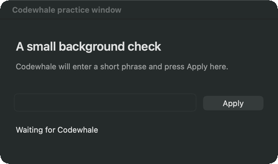

# A real background check



These are three actual app-window captures from one local macOS run, displayed
for two seconds each. They show the disposable practice app before input,
after text entry, and after pressing Apply. The animation is a sequence of
captures, not a recording of the elapsed timing.

The practice app independently observed the received text and sampled the
foreground app and shared pointer 720 times. Both stayed unchanged. The
source backend used the signed, packaged native helper; no model was called.
This proves this local workflow, not every app or a model-driven task.

## Try it

Open **Computer Use…** from the whale menu, grant any missing permissions,
then choose **Run background check**. Keep the pointer still until it
finishes. Movement produces an inconclusive result instead of a false pass.
The practice window closes itself after the check.

To save your own three captures from the source checkout:

```sh
node scripts/demo.mjs
```

The script uses the installed helper in `~/Applications`. Set
`CODEWHALE_CU_APP_BUNDLE` if your app is elsewhere. Output goes into a fresh
`receipts/demo-*` directory with the independent result in `receipt.json`.
No screenshots of your other apps, task text, clipboard, or documents are used.

## Verify an installed helper through MCP

```sh
node scripts/verify-background-macos.mjs \
  --bundle "$HOME/Applications/Codewhale Computer Use.app" \
  --installed-helper --switch-mid-action --out /tmp/cu-background.json
```

The first trial keeps the current app and pointer unchanged while the helper
edits, applies, scrolls and captures a disposable background app. The optional
`--switch-mid-action` adds a separate trial: it intentionally activates an
owned decoy while a held key is pending in the target. The target must receive
the key release after the switch, the decoy must receive no input, and focus
must stay on the decoy. An independent process samples foreground and pointer
throughout. Keep the pointer still; unrelated input invalidates the trial.
The deliberate-switch actuator also needs Accessibility permission for the
test host so it can activate the decoy independently of the helper.

The receipt separates both trials and records the running helper's identity.
It remains local because it includes foreground app names. The script closes
only its own clients and fixtures; `--installed-helper` leaves the installed
helper running. This verifies direct MCP calls, not a model-driven Engine turn.
